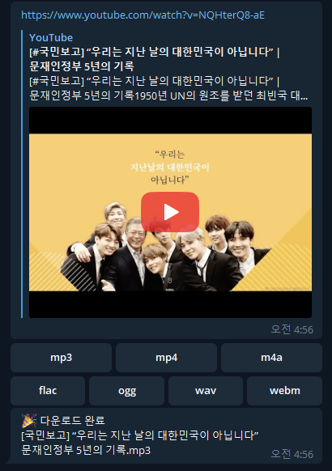
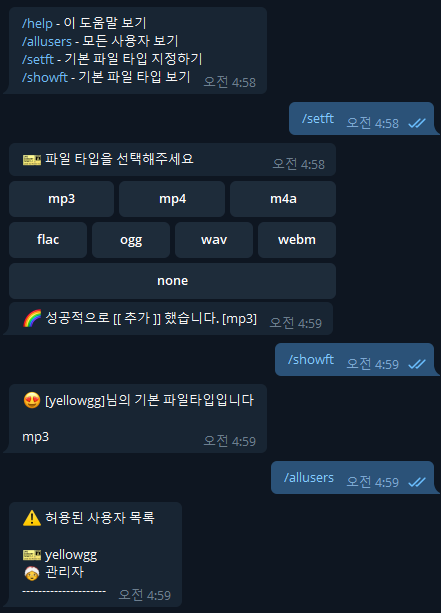
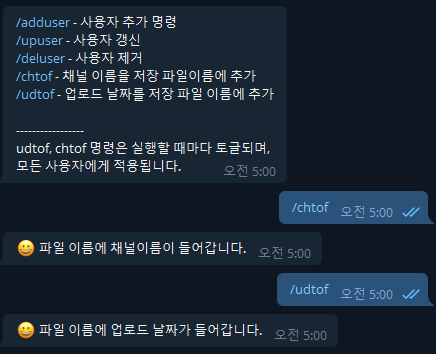
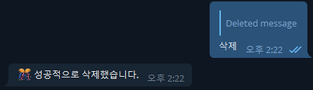

[English](README.md)

# youtube-dl download telegram bot

[ydls](https://hub.docker.com/r/mwader/ydls/dockerfile)와 함께 사용할 수 있는 봇으로, Docker가 설치되는 곳이면 어디든 설치가 가능하다 (ex: 리눅스 서버, 시놀로지 나스)

기존에 ydls 이미지를 그대로 사용하였지만, `채널 이름`과, `업로드 날짜`를 파일이름에 추가해달라는 요청으로, 부득이 하게 ydls코드를 수정하게 됨

그리하여 repo에 submodule로 포함하게 됨

# 주요기능

- Youtube 다운로드 및 [ydls](https://hub.docker.com/r/mwader/ydls/dockerfile)가 지원하는 다른 사이트 (ex: twitter)

  - [지원 사이트](https://ytdl-org.github.io/youtube-dl/supportedsites.html)
  - 지원 포맷 : `mp3, mp4, m4a, flac, ogg, wav, webm`
  - Youtube의 url을 봇에게 보내면, 아래와 같이 포맷을 선택할 수 있다
  - 포맷을 선택하면 다운로드를 시작
  - 다운로드가 완료되면 완료 메세지를 보내줌
  - `setft`로 기본 타입을 설정하면 다음부터 그 포맷으로 자동 다운로드 (여러 타입 선택 가능)

    

- Playlist 다운로드

  - `https://www.youtube.com/playlist?list`로 시작하는 URL은 playlist로 인식하고 모든 영상을 다운로드 함
  - Playlist URL은 반드시 공개된 URL이어야 함
  - Playlist 다운로드 진행 중 멈추고 싶으면 다음 단어중 하나를 봇에게 보내면 된다(`정지, 멈춤, s, stop`)

- 사용자,관리자 구분

  - 설치 시 `.env`에 `TELEGRAM_ADMIN_USERNAME`에 등록한 아이디가 관리자
  - 해당 관리자가 사용자 또는 관리자를 등록가능

- 사용자 메뉴

  - `사용자`는 관리자가 등록한 사용자를 말함
  - `help, allusers, setft, showft` 명령 사용가능
  - `help`: 도움말 보기
  - `allusers`: 등록된 사용자 보기
  - `setft`: 기본 파일 타입 지정하기 (파일 타입이 지정되면 다운로드 파일 포맷을 물어보지 않는다. `none`을 선택하면 해제)
  - `showft`: 내가 지정한 기본 파일 타입 보기

    

- 관리자 메뉴

  - 해당 관리자가 사용자 또는 관리자를 등록가능
  - `ahelp`: 관리자 도움말 보기
  - `adduser`: 사용자 또는 관리자 추가
  - `upuser`: 사용자 정보 변경
  - `deluser`: 사용자 제거
  - `chtof`: 다운로드 파일 이름에 채널이름을 추가 (한번 더 실행하면 토글 됨, **봇을 사용하는 모든 사용자에게 적용**)
  - `udtof`: 다운로드 파일 이름에 업로드 날짜를 추가 (한번 더 실행하면 토글 됨, **봇을 사용하는 모든 사용자에게 적용**)

    

- 파일 삭제

  - 다운로드 완료 메세지에 reply로 아래 단어 중 하나 입력하면 저장 파일을 삭제합니다
  - `지우기, 삭제, d, del, delete`

    

# environments

.env 파일의 값 설명

| key                       | 설명                                                                              | 예시           |
| ------------------------- | --------------------------------------------------------------------------------- | -------------- |
| `PUID`                    | host UID (`id -u`로 확인)                                                         | 1000           |
| `GUID`                    | host GID (`id -g`로 확인)                                                         | 1000           |
| `TELEGRAM_BOT_API_TOKEN`  | 봇 토큰                                                                           |                |
| `TELEGRAM_ADMIN_USERNAME` | 텔레그램 아이디. 텔레그램 아이디가 `@superman`이라면 `@`빼고, `superman`으로 입력 |                |
| `TELEGRAM_ADMIN_DESC`     | 관리자 설명                                                                       | 수퍼맨         |
| `TELEGRAM_ADMIN_CHATID`   | 특정 명령이나 에러 발생 시 메세지를 보낼 chat id                                  | 11223344       |
| `DOWNLOAD_PATH`           | host의 다운로드 위치                                                              | ./bot/download |
| `BOT_LANG`                | 언어 설정 (ko: 한국어, en: 영어)                                                  | ko or en       |

# 설치

> docker, docker-compose는 기본적으로 설치하셔야 합니다.

- `git clone --recurse-submodules https://github.com/yellowgg2/youngs-ytdl` 명령으로 submodule까지 clone
- `.env` 파일의 값을 본인에 맞게 설정
- `Synology` 사용자 이며, `DS audio`와 함께 사용하고 싶은 사람
  - 부팅 스크립트로 repo에 첨부된 `download-watch.sh`를 실행하는 스케쥴러를 등록해야 함
  - `download-watch.sh`의 `DOWNLOAD_PATH`값을 `DS Audio` 가 바라보는 위치로 변경
  - 이 작업을 하지 않으면 다운로드를 완료해도 해당 파일이 `DS audio`에서 보이지 않음
- `docker-compose up -d --build` 실행

# 업데이트

업데이트 시에는 아래 두 명령을 차례로 실행

- git pull --recurse-submodules
- git submodule update --remote
- docker-compose down && docker-compose up -d --build
