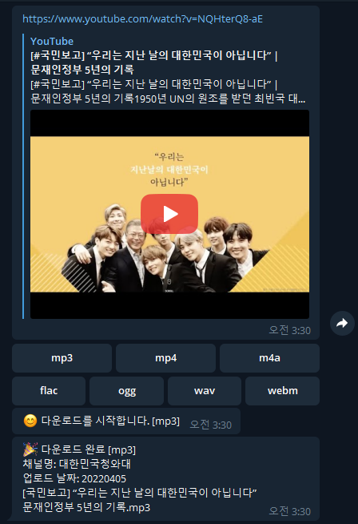

[English](README.md)

# YouTube 다운로드 텔레그램 봇

YouTube 및 다양한 미디어 사이트에서 영상/음악을 다운로드할 수 있는 텔레그램 봇입니다. Docker가 설치 가능한 모든 환경에서 사용할 수 있습니다. (리눅스 서버, 시놀로지 NAS 등)

## 목차
- [주요 기능](#주요기능)
- [설치](#설치)
- [환경 설정](#environments)
- [사용법](#사용법)
- [업데이트](#업데이트)

## 개요

이 봇은 강력한 미디어 다운로더인 [yt-dlp](https://github.com/yt-dlp/yt-dlp)를 내장하여 사용합니다. 파일명에 `채널 이름`과 `업로드 날짜`를 자동으로 추가하는 기능을 지원합니다.

## 주요기능

### 미디어 다운로드
- YouTube 및 1000개 이상의 사이트 지원 (Twitter, Instagram, TikTok 등)
  - [지원 사이트 전체 목록](https://github.com/yt-dlp/yt-dlp/blob/master/supportedsites.md)
- **지원 포맷**: `mp3`, `mp4`, `m4a`, `flac`, `ogg`, `wav`, `webm`
- URL을 봇에게 전송하면 포맷 선택 버튼이 표시됩니다
- 선택한 포맷으로 즉시 다운로드가 시작됩니다
- `setft` 명령으로 기본 포맷을 설정하면 자동 다운로드 (여러 포맷 동시 선택 가능)

  

### 플레이리스트 다운로드

- `https://www.youtube.com/playlist?list`로 시작하는 URL 자동 인식
- 플레이리스트의 모든 영상을 순차적으로 다운로드
- **주의**: 플레이리스트는 반드시 공개 상태여야 함
- 다운로드 중단: `정지`, `멈춤`, `s`, `stop` 중 하나를 입력

### 사용자 관리 시스템

- `.env` 파일의 `TELEGRAM_ADMIN_USERNAME`에 설정한 사용자가 최초 관리자
- 관리자가 일반 사용자 또는 추가 관리자를 등록 가능

### 사용자 명령어

| 명령어 | 설명 |
|--------|------|
| `/help` | 도움말 표시 |
| `/allusers` | 등록된 모든 사용자 목록 확인 |
| `/setft` | 기본 다운로드 포맷 설정 (`none` 선택 시 해제) |
| `/showft` | 설정된 기본 포맷 확인 |
| `/ff [검색어]` | 다운로드된 파일 검색 |

  

### 관리자 명령어

| 명령어 | 설명 |
|--------|------|
| `/ahelp` | 관리자 도움말 표시 |
| `/adduser [ID] [이름] [타입]` | 사용자/관리자 추가 |
| `/upuser [ID] [이름] [타입]` | 사용자 정보 수정 |
| `/deluser [ID]` | 사용자 삭제 |
| `/chtof` | 파일명에 채널 이름 추가 (토글, **전체 사용자 적용**) |
| `/udtof` | 파일명에 업로드 날짜 추가 (토글, **전체 사용자 적용**) |

  

### 파일 삭제 기능

다운로드 완료 메시지에 답장(Reply)으로 다음 중 하나를 입력하면 파일이 삭제됩니다:
- `지우기`, `삭제`, `d`, `del`, `delete`

  

## environments

`.env` 파일 설정값

| 변수명 | 설명 | 예시 |
|--------|------|------|
| `PUID` | 호스트 사용자 ID (`id -u` 명령으로 확인) | `1000` |
| `PGID` | 호스트 그룹 ID (`id -g` 명령으로 확인) | `1000` |
| `TELEGRAM_BOT_API_TOKEN` | BotFather에서 발급받은 봇 토큰 | - |
| `TELEGRAM_ADMIN_USERNAME` | 관리자 텔레그램 ID (`@` 제외)<br>예: `@superman` → `superman` | `superman` |
| `TELEGRAM_ADMIN_DESC` | 관리자 설명 | `수퍼맨` |
| `TELEGRAM_ADMIN_CHATID` | 오류 알림을 받을 채팅 ID | `11223344` |
| `DOWNLOAD_PATH` | 다운로드 경로 (호스트) | `./bot/download` |
| `SEARCH_ROOT_PATH` | 파일 검색 경로 (선택) | `/music` |
| `BOT_LANG` | 언어 설정 (`ko`: 한국어, `en`: 영어) | `ko` |

## 설치

### 필수 요구사항
- Docker
- Docker Compose

### 설치 과정

1. **저장소 복제**
   ```bash
   git clone https://github.com/yellowgg2/youngs-ytdl
   cd youngs-ytdl
   ```

2. **환경 설정**
   ```bash
   cp .env.sample .env
   # .env 파일을 편집하여 필요한 값 설정
   ```

3. **봇 실행**
   ```bash
   docker compose up -d --build
   ```

### Synology NAS 사용자를 위한 추가 설정

DS Audio와 연동하려면:
1. 제어판에서 작업 스케줄러 생성 (부팅 시 실행)
2. `download-watch.sh` 스크립트 등록
3. 스크립트 내 `DOWNLOAD_PATH`를 DS Audio 감시 폴더로 변경
   ```bash
   DOWNLOAD_PATH="/music"  # DS Audio가 감시하는 경로
   ```

## 사용법

1. 텔레그램에서 봇 검색 및 시작
2. YouTube URL을 봇에게 전송
3. 원하는 포맷 선택 (또는 기본 포맷으로 자동 다운로드)
4. 다운로드 완료 대기

## 업데이트

### yt-dlp 엔진 업데이트
yt-dlp의 최신 버전으로 업데이트 (YouTube 변경사항 대응):
```bash
# 최신 yt-dlp로 봇 재빌드 (최신 베이스 이미지 사용)
docker compose build --pull ytdl-download-bot && docker compose up -d ytdl-download-bot
```

### 봇 코드 업데이트
저장소의 최신 코드로 업데이트:
```bash
# 최신 코드 가져오기 및 재빌드
git pull
docker compose up -d --build
```

### 전체 시스템 업데이트
모든 구성 요소를 최신 버전으로 업데이트:
```bash
git pull
docker compose build --pull --no-cache
docker compose up -d
```

> **팁**: YouTube 다운로드가 실패하는 경우, 대부분 yt-dlp 업데이트로 해결됩니다. 첫 번째 명령어로 빠르게 yt-dlp만 업데이트할 수 있습니다.
