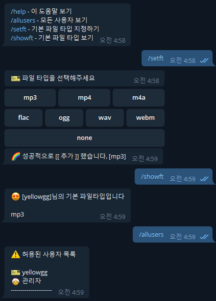

# youtube-dl download telegram bot

[ydls](https://hub.docker.com/r/mwader/ydls/dockerfile)와 함께 사용할 수 있는 봇으로, Docker가 설치되는 곳이면 어디든 설치가 가능하다 (ex: 리눅스 서버, 시놀로지 나스)

기존에 ydls 이미지를 그대로 사용하였지만, `채널 이름`과, `업로드 날짜`를 파일이름에 추가해달라는 요청으로, 부득이 하게 ydls코드를 수정하게 됨

그리하여 repo에 submodule로 포함하게 됨

# 주요기능

- 사용자,관리자 구분

  - 설치 시 `docker-compose.yml`에 `ADMIN_USERNAME`에 등록한 아이디가 관리자
  - 해당 관리자가 사용자 또는 관리자를 등록가능

- 사용자 메뉴

  - `사용자`는 관리자가 등록한 사용자를 말함
  - `help, allusers, setft, showft` 명령 사용가능
  - `help`: 도움말 보기
  - `allusers`: 등록된 사용자 보기
  - `setft`: 기본 파일 타입 지정하기 (파일 타입이 지정되면 다운로드 파일 포맷을 물어보지 않는다. `none`을 선택하면 해제)
  - `showft`: 내가 지정한 기본 파일 타입 보기

    

- 관리자 메뉴

  - 설치 시 `docker-compose.yml`에 `ADMIN_USERNAME`에 등록한 아이디가 관리자
  - 해당 관리자가 사용자 또는 관리자를 등록가능
  - `adduser`: 사용자 또는 관리자 추가
  - `upuser`: 사용자 정보 변경
  - `deluser`: 사용자 제거
  - `chtof`: 다운로드 파일 이름에 채널이름을 추가 (한번 더 실행하면 토글 됨, **봇을 사용하는 모든 사용자에게 적용**)
  - `udtof`: 다운로드 파일 이름에 옵로드 날짜를 추가 (한번 더 실행하면 토글 됨, **봇을 사용하는 모든 사용자에게 적용**)

    

- Youtube 다운로드

  - Youtube의 url을 봇에게 보내면, 아래와 같이 포맷을 선택할 수 있다
  - 포맷을 선택하면 다운로드를 시작
  - 다운로드가 완료되면 완료 메세지를 보내줌
  - `setft`로 기본 타입을 설정하면 다음부터 그 포맷으로 자동 다운로드

    

# environments

docker-compose.yml의 env, args값 설명

| key              | 설명                                                         | 예시     |
| ---------------- | ------------------------------------------------------------ | -------- |
| `PUID`           | host PUID                                                    | 1000     |
| `GUID`           | host GUID                                                    | 1000     |
| `BOT_API_TOKEN`  | 봇 토큰                                                      |          |
| `ADMIN_USERNAME` | 텔레그램 아이디 - 관리자 용 (보통 설치하는 사람 아이디 입력) |          |
| `ADMIN_DESC`     | 관리자 설명                                                  |          |
| `ADMIN_CHATID`   | 특정 명령이나 에러 발생 시 메세지를 보낼 chat id             | 11223344 |

# 설치

> docker, docker-compose는 기본적으로 설치하셔야 합니다.

- `git clone --recurse-submodules https://github.com/yellowgg2/youngs-ytdl` 명령으로 submodule까지 clone
- `docker-compose.yml` 파일의 environment와 args에 있는 PUID, PGID를 host 계정의 ID 와 일치 시켜야 함
- `UNAME`은 변경할 필요 없음
- `/ytdlbot/download` 경로를 host의 다운로드를 원하는 위치와 마운트
- `시놀로지` 사용자라면, Music folder에 마운트를 하고 싶으면 스크립트 안에 경로를 바꿔 준 후 indexing을 위해 `download-watch.sh`를 부팅 스케줄러로 걸어준다
  - 이 작업을 하지 않으면 `DS Audio`에서 파일이 다운로드 되어도 갱신이 안됨
- `docker-compose up -d --build` 실행
